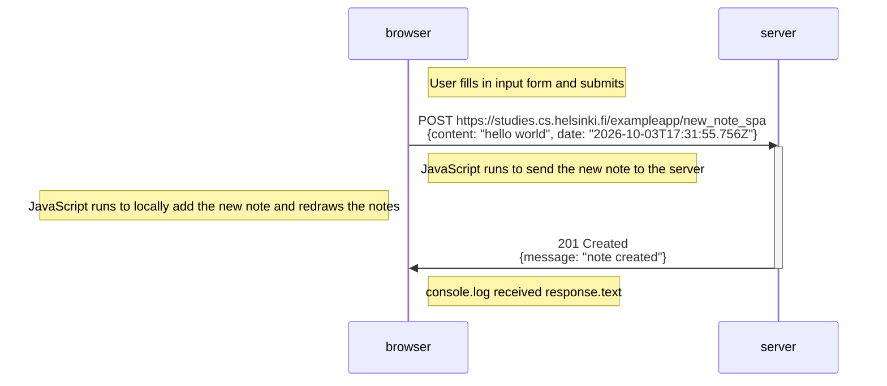

```mermaid
    sequenceDiagram
        participant browser
        participant server

        Note right of browser: User fills in input form and submits
        
        browser->>server: POST https://studies.cs.helsinki.fi/exampleapp/new_note_spa<br/>{content: "hello world", date: "2026-10-03T17:31:55.756Z"}
        activate server

        Note right of browser: JavaScript runs to send the new note to the server
        Note left of browser: JavaScript runs to locally add the new note and redraws the notes

        server->>browser: 201 Created<br>{message: "note created"}
        deactivate server

        Note right of browser: console.log received response.text
```